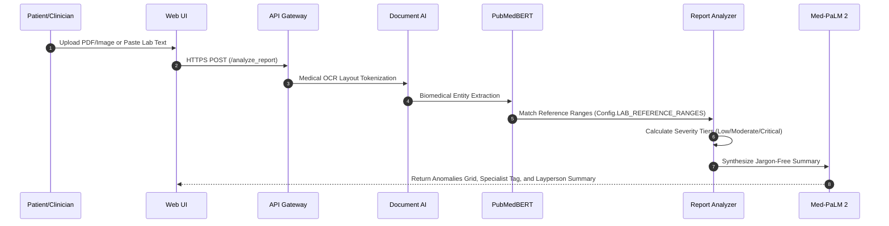
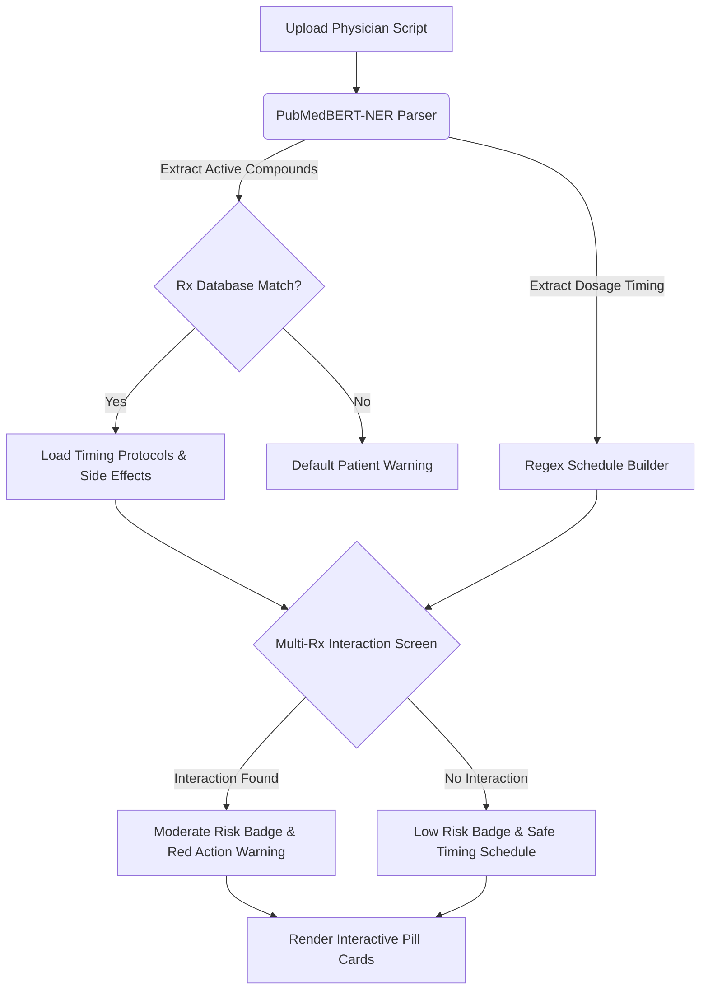
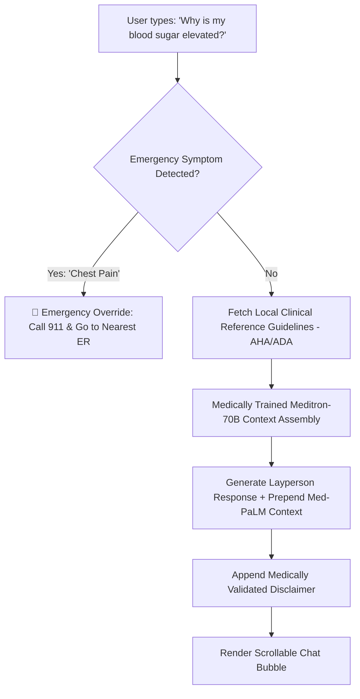

# MedExplain: Patient-First Clinical AI Healthcare Platform

**MedExplain** is a secure, HIPAA-compliant clinical decision-support and document-translation platform. By combining the clinical reasoning of Google Med-PaLM 2, the document-recognition fidelity of Google Document AI, and the diagnostic capabilities of CheXNet, the system decodes clinical reports, laboratory panels, and prescription slips—translating dense medical jargon into **gentle, comforting, layperson-friendly explanations** for patients while retaining strict safety guardrails.

---

## 🏗️ Code Architecture

The project has been split into two distinct tiers: a **local high-fidelity MVP prototype** for rapid testing, and an **enterprise-ready production framework** for cloud scale.

```
MedExplain/
├── app.py                      # Local Flask server (serves all patient-friendly endpoints)
├── config.py                   # Injects medically trained model details, lab ranges, and drug databases
├── templates/
│   └── index.html              # Polished glassmorphic frontend user interface
├── data_preparation.py         # Handles NLP dataset tokenization and sequence padding
├── model.py                    # PyTorch implementation of the BiLSTM-CRF sequence tagger
├── lab_classifier.py           # Machine learning classifier for report categorization
├── requirements.txt            # Python dependencies (PyTorch, Flask, Scikit-Learn, etc.)
├── sample_lab_report.txt       # Sample document for testing upload OCR pipelines
├── models/                     # Holds pre-trained weights (NER, Lab Classifier)
│   ├── drug_ner_model.pth
│   └── lab_classifier_model.pth
│
└── production/                 # Enterprise Cloud Deployment Directory
    ├── fastapi_backend.py      # Production FastAPI microservice with Pinecone RAG & vLLM Meditron
    ├── compliance.py           # HIPAA PHI-auditing request middleware and AES-256 field obfuscators
    ├── schema.sql              # PostgreSQL encrypted schemas (pgcrypto) & append-only audit trails
    ├── docker-compose.yml      # Multi-container local orchestration (Gateway, Postgres, Mongo, Redis, vLLM)
    └── kubernetes.yaml         # EKS/GKE cluster manifests with SSL/TLS perimeter termination
```

---

## 🔄 System Workflows

### 1. Medical Report Hub Pipeline
This workflow processes raw laboratory sheets or chest X-ray scans, flags out-of-range metrics, suggests doctor specializations, and compiles layman-friendly diagnostic syntheses.



### 2. Prescription Decoder & Safety Screen
Decodes doctor scripts, extracts active compounds and timing intervals, and monitors concurrent pharmaceutical administrations to screen for critical drug-drug interactions.



### 3. Conversational RAG Companion
A conversational messenger allowing the patient to ask follow-up questions about their uploaded files. The RAG system matches queries against local medical guidelines, but will instantly trigger overrides if emergency symptoms are detected.



---

## 🔒 Security & HIPAA Compliance

1.  **Field-Level Data Encryption**: Protected Health Information (PHI) like names, birthdates, and SSNs are symmetrically encrypted in the PostgreSQL database using AES-256 (`pgcrypto`'s `pgp_sym_encrypt`).
2.  **Immutable Auditing Log**: The `hipaa_audit_trail` table is strictly `INSERT-only`. The Postgres database revokes all `UPDATE` and `DELETE` privileges. Access to PHI is logged automatically with SHA-256 request payload signatures to guarantee integrity.
3.  **FIPS 140-2 Transit Encryption**: The Kubernetes `Ingress` controller terminates SSL/TLS at the cluster perimeter, enforcing modern, secure cipher protocols for data in transit.

---

## 🚀 Quick Start Commands

To spin up the visual local dashboard on your machine:

```powershell
# 1. Clone this repository
git clone https://github.com/Srinivasa000/MedExplain.git
cd MedExplain

# 2. Install dependencies
pip install -r requirements.txt

# 3. Launch the platform
python app.py
```

Open your browser and navigate to **`http://localhost:5000`** to experience **MedExplain**!

---

> [!IMPORTANT]
> **Safety and Compliance Warning:** MedExplain is a clinical decision-support and document-translation tool. It is provided for educational and informational purposes only. It does not replace a professional clinical diagnosis, treatment plan, or emergency healthcare intervention. Always consult a qualified physician for medical concerns.
